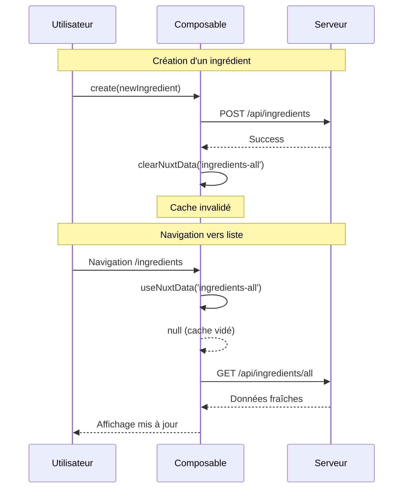
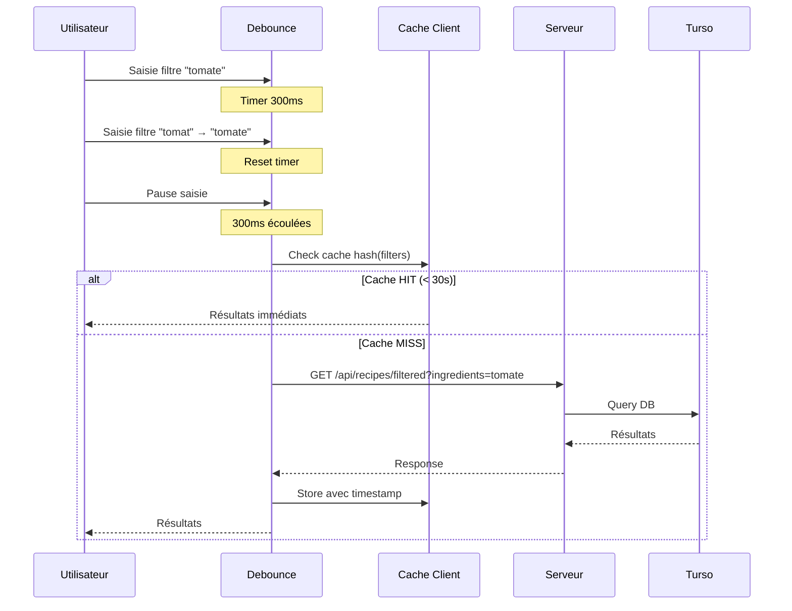
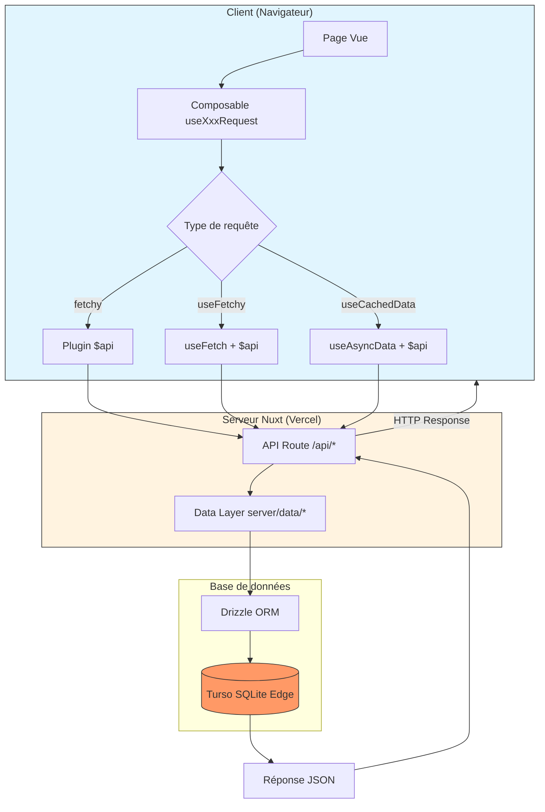
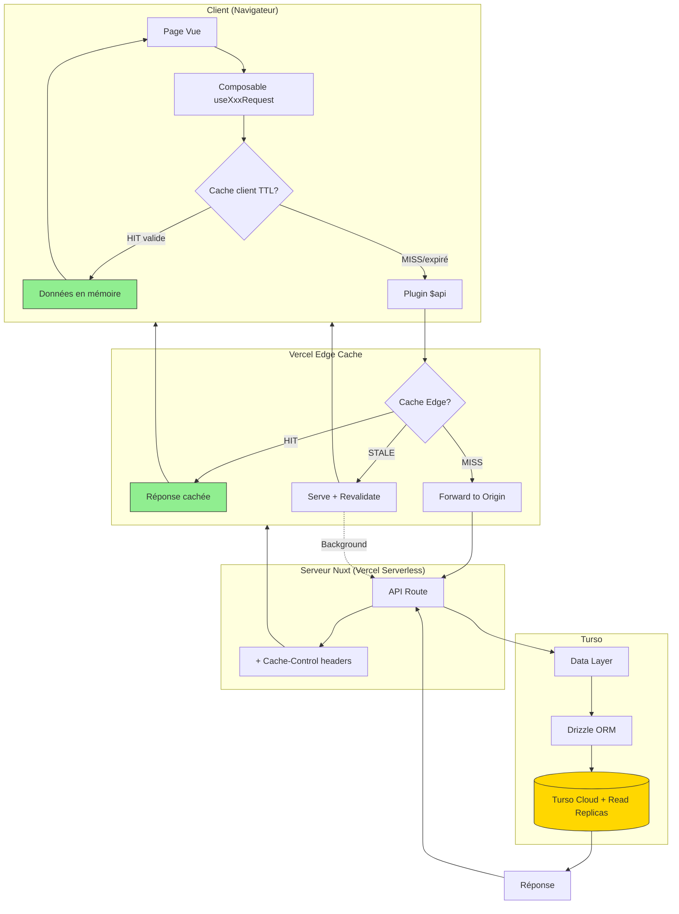
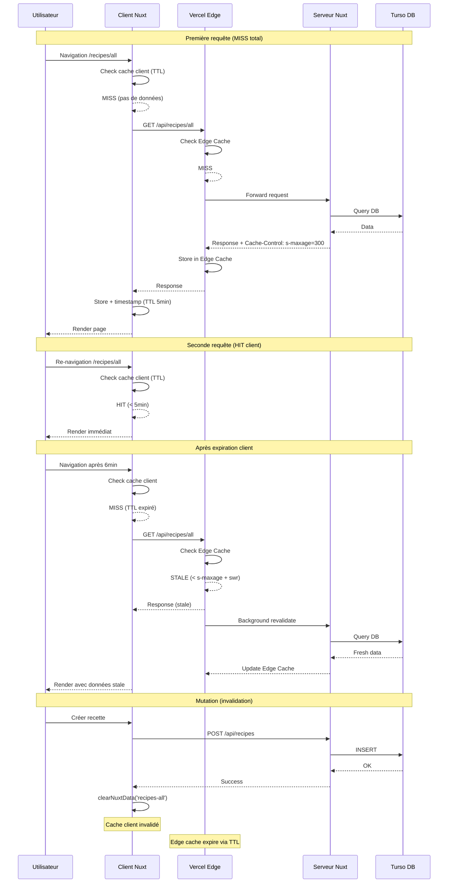
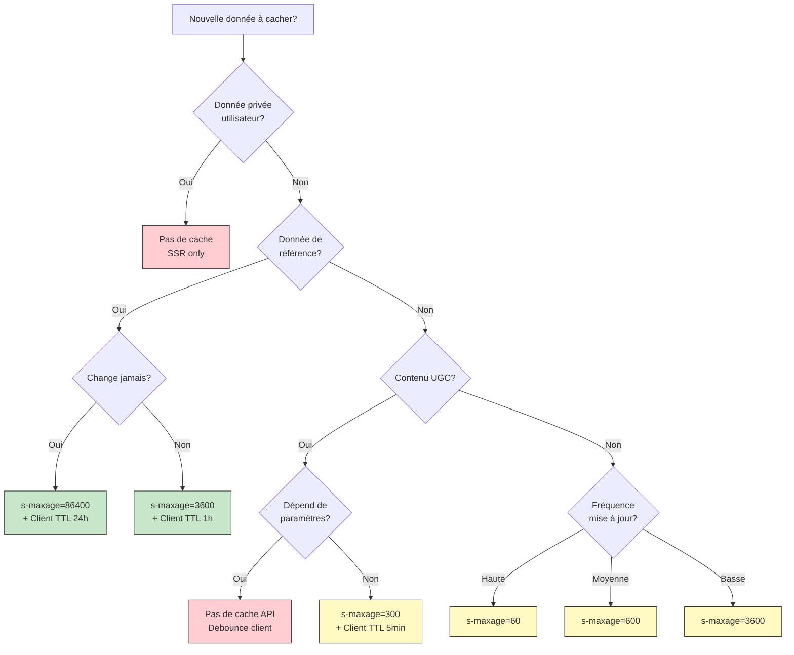
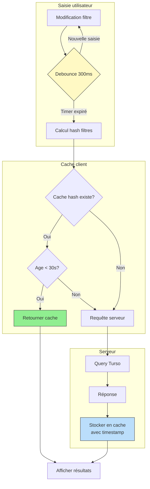

# Stratégie de Cache - Recepto

## 1. Résumé exécutif [CORRIGÉ]

Recepto est une application de gestion de recettes communautaire construite avec Nuxt 4, Drizzle ORM et Turso (SQLite edge). L'analyse révèle **38 endpoints API** dont 13 en lecture seule, et **7 pages** avec des besoins de cache variés.

**Constat actuel** : Aucune stratégie de cache n'est implémentée. Toutes les requêtes frappent directement Turso, générant une latence évitable pour les données référentielles (allergènes, types de plats, saisons) qui changent rarement.

**Gains potentiels estimés** :
- Réduction de 60-80% des requêtes DB pour les données de référence
- Temps de réponse divisé par 2-3 sur les pages de filtrage
- Meilleure expérience utilisateur avec SWR sur les pages publiques

**Priorité recommandée** : Implémenter d'abord les headers `Cache-Control` sur les API routes (stratégie primaire sur Vercel), puis le cache client avec TTL personnalisé pour les données de référence.

> **Avertissement Vercel Serverless** : Le cache Nitro en mémoire (routeRules SWR sur les API) ne persiste pas entre les cold starts. Les headers `Cache-Control` exploitant le Vercel Edge Cache sont la stratégie primaire recommandée pour les endpoints API.

---

## 2. Inventaire des requêtes

### 2.1 Requêtes API côté client

| Fichier | Méthode | Type | Endpoint | Fréquence | Dépendances | Cache actuel |
|---------|---------|------|----------|-----------|-------------|--------------|
| `useAllergensRequest.ts:23` | `fetchAll()` | GET | `/api/allergens/all` | Montage filtres | Aucune | Non |
| `useAllergensRequest.ts:42` | `getAll()` | GET | `/api/allergens/all` | SSR | Aucune | Nuxt natif |
| `useAllergensRequest.ts:60` | `getAllCached()` | GET | `/api/allergens/all` | Réutilisation | Aucune | `allergens-all` |
| `useDishTypesRequest.ts:23` | `fetchAll()` | GET | `/api/dishTypes/all` | Montage filtres | Aucune | Non |
| `useDishTypesRequest.ts:42` | `getAll()` | GET | `/api/dishTypes/all` | SSR | Aucune | Nuxt natif |
| `useDishTypesRequest.ts:60` | `getAllCached()` | GET | `/api/dishTypes/all` | Réutilisation | Aucune | `dishTypes-all` |
| `useMealTypesRequest.ts:23` | `fetchAll()` | GET | `/api/mealTypes/all` | Montage filtres | Aucune | Non |
| `useMealTypesRequest.ts:42` | `getAll()` | GET | `/api/mealTypes/all` | SSR | Aucune | Nuxt natif |
| `useMealTypesRequest.ts:60` | `getAllCached()` | GET | `/api/mealTypes/all` | Réutilisation | Aucune | `mealTypes-all` |
| `useSeasonsRequest.ts:23` | `fetchAll()` | GET | `/api/seasons/all` | Montage filtres | Aucune | Non |
| `useSeasonsRequest.ts:42` | `getAll()` | GET | `/api/seasons/all` | SSR | Aucune | Nuxt natif |
| `useSeasonsRequest.ts:60` | `getAllCached()` | GET | `/api/seasons/all` | Réutilisation | Aucune | `seasons-all` |
| `useUnitsRequest.ts:23` | `fetchAll()` | GET | `/api/units/all` | Création recette | Aucune | Non |
| `useUnitsRequest.ts:42` | `getAll()` | GET | `/api/units/all` | SSR | Aucune | Nuxt natif |
| `useUnitsRequest.ts:60` | `getAllCached()` | GET | `/api/units/all` | Réutilisation | Aucune | `units-all` |
| `useFoodTypesRequest.ts:21` | `fetchAll()` | GET | `/api/foodTypes/all` | Création ingrédient | Aucune | Non |
| `useFoodTypesRequest.ts:40` | `getAll()` | GET | `/api/foodTypes/all` | SSR | Aucune | Nuxt natif |
| `useIngredientsRequest.ts:26` | `fetchAll()` | GET | `/api/ingredients/all` | Montage filtres | Aucune | Non |
| `useIngredientsRequest.ts:53` | `fetchDashboard()` | GET | `/api/ingredients/dashboard` | Dashboard | userId | Non |
| `useIngredientsRequest.ts:66` | `fetchSeasonals()` | GET | `/api/ingredients/seasonals` | Chart saisonnier | Aucune | Non |
| `useIngredientsRequest.ts:85` | `getAll()` | GET | `/api/ingredients/all` | SSR | Aucune | Nuxt natif |
| `useIngredientsRequest.ts:149` | `getAllCached()` | GET | `/api/ingredients/all` | Réutilisation | Aucune | `ingredients-all` |
| `useUstensilsRequest.ts:25` | `fetchAll()` | GET | `/api/ustensils/all` | Montage filtres | Aucune | Non |
| `useUstensilsRequest.ts:52` | `fetchDashboard()` | GET | `/api/ustensils/dashboard` | Dashboard | userId | Non |
| `useUstensilsRequest.ts:71` | `getAll()` | GET | `/api/ustensils/all` | SSR | Aucune | Nuxt natif |
| `useUstensilsRequest.ts:120` | `getAllCached()` | GET | `/api/ustensils/all` | Réutilisation | Aucune | `ustensils-all` |
| `useRecipesCategoriesRequest.ts:26` | `fetchAll()` | GET | `/api/recipesCategories/all` | Création recette | Aucune | Non |
| `useRecipesCategoriesRequest.ts:54` | `fetchFiltered()` | GET | `/api/recipesCategories/filtered` | Navigation filtres | Query complexe | Non |
| `useRecipesCategoriesRequest.ts:71` | `fetchSearch()` | GET | `/api/recipesCategories/search` | Recherche | Query texte | Non |
| `useRecipesCategoriesRequest.ts:90` | `getAll()` | GET | `/api/recipesCategories/all` | SSR | Aucune | Nuxt natif |
| `useRecipesCategoriesRequest.ts:159` | `getAllCached()` | GET | `/api/recipesCategories/all` | Réutilisation | Aucune | `recipesCategories-all` |
| `useRecipesRequest.ts:27` | `fetchAll()` | GET | `/api/recipes/all` | Liste complète | Aucune | Non |
| `useRecipesRequest.ts:41` | `fetchById()` | GET | `/api/recipes/{id}` | Détail recette | recipeId | Non |
| `useRecipesRequest.ts:55` | `fetchByIdForEdit()` | GET | `/api/recipes/{id}?edit=true` | Édition | recipeId | Non |
| `useRecipesRequest.ts:68` | `fetchDashboard()` | GET | `/api/recipes/dashboard` | Dashboard | userId | Non |
| `useRecipesRequest.ts:82` | `fetchFiltered()` | GET | `/api/recipes/filtered` | Navigation filtres | Query complexe | Non |
| `useRecipesRequest.ts:105` | `getAll()` | GET | `/api/recipes/all` | SSR | Aucune | Nuxt natif |
| `useRecipesRequest.ts:121` | `getById()` | GET | `/api/recipes/{id}` | SSR détail | recipeId | Nuxt natif |
| `useRecipesRequest.ts:190` | `getAllCached()` | GET | `/api/recipes/all` | Réutilisation | Aucune | `recipes-all` |

### 2.2 Opérations d'écriture (déclencheurs d'invalidation)

| Fichier | Méthode | Type | Endpoint | Entités impactées |
|---------|---------|------|----------|-------------------|
| `useAuthRequest.ts:22` | `login()` | POST | `/api/auth/login` | Session |
| `useAuthRequest.ts:35` | `register()` | POST | `/api/auth/register` | User |
| `useAuthRequest.ts:47` | `loginAsGuest()` | POST | `/api/auth/guest` | Session |
| `useIngredientsRequest.ts:167` | `create()` | POST | `/api/ingredients` | Ingredients, Filtres |
| `useIngredientsRequest.ts:185` | `update()` | PUT | `/api/ingredients/{id}` | Ingredients |
| `useIngredientsRequest.ts:202` | `delete()` | DELETE | `/api/ingredients/{id}` | Ingredients, Filtres |
| `useUstensilsRequest.ts:138` | `create()` | POST | `/api/ustensils` | Ustensils, Filtres |
| `useUstensilsRequest.ts:156` | `update()` | PUT | `/api/ustensils/{id}` | Ustensils |
| `useUstensilsRequest.ts:173` | `delete()` | DELETE | `/api/ustensils/{id}` | Ustensils, Filtres |
| `useRecipesCategoriesRequest.ts:177` | `create()` | POST | `/api/recipesCategories` | Categories |
| `useRecipesCategoriesRequest.ts:195` | `update()` | PUT | `/api/recipesCategories/{id}` | Categories |
| `useRecipesCategoriesRequest.ts:212` | `delete()` | DELETE | `/api/recipesCategories/{id}` | Categories |
| `useRecipesRequest.ts:208` | `create()` | POST | `/api/recipes` | Recipes, Categories |
| `useRecipesRequest.ts:226` | `update()` | PUT | `/api/recipes/{id}` | Recipes |
| `useRecipesRequest.ts:243` | `delete()` | DELETE | `/api/recipes/{id}` | Recipes, Categories |

### 2.3 Endpoints serveur (server/api/)

| Fichier | Route | Méthode | Tables | Type | Cache recommandé |
|---------|-------|---------|--------|------|------------------|
| `allergens/all.get.ts` | `/api/allergens/all` | GET | allergen | Lecture | Cache-Control 1h |
| `dishTypes/all.get.ts` | `/api/dishTypes/all` | GET | dish_type | Lecture | Cache-Control 1h |
| `foodTypes/all.get.ts` | `/api/foodTypes/all` | GET | food_type | Lecture | Cache-Control 1h |
| `mealTypes/all.get.ts` | `/api/mealTypes/all` | GET | meal_type | Lecture | Cache-Control 1h |
| `seasons/all.get.ts` | `/api/seasons/all` | GET | season | Lecture | Cache-Control 1h |
| `units/all.get.ts` | `/api/units/all` | GET | unit | Lecture | Cache-Control 1h |
| `ingredients/all.get.ts` | `/api/ingredients/all` | GET | ingredient | Lecture | Cache-Control 10min |
| `ingredients/[id].get.ts` | `/api/ingredients/{id}` | GET | ingredient | Lecture | Cache-Control 5min |
| `ingredients/seasonals.get.ts` | `/api/ingredients/seasonals` | GET | ingredient, food_type | Lecture | Cache-Control 1j |
| `ingredients/dashboard.get.ts` | `/api/ingredients/dashboard` | GET | ingredient | Lecture privée | Aucun |
| `ustensils/all.get.ts` | `/api/ustensils/all` | GET | ustensil | Lecture | Cache-Control 10min |
| `ustensils/[id].get.ts` | `/api/ustensils/{id}` | GET | ustensil | Lecture | Cache-Control 5min |
| `ustensils/dashboard.get.ts` | `/api/ustensils/dashboard` | GET | ustensil | Lecture privée | Aucun |
| `recipesCategories/all.get.ts` | `/api/recipesCategories/all` | GET | recipes_category | Lecture | Cache-Control 10min |
| `recipesCategories/[id].get.ts` | `/api/recipesCategories/{id}` | GET | recipes_category | Lecture | Cache-Control 5min |
| `recipesCategories/filtered.get.ts` | `/api/recipesCategories/filtered` | GET | Multiple (7 tables) | Lecture | Non (dynamique) |
| `recipesCategories/search.get.ts` | `/api/recipesCategories/search` | GET | recipes_category, recipe | Lecture | Cache-Control 5min |
| `recipes/all.get.ts` | `/api/recipes/all` | GET | recipe | Lecture | Cache-Control 10min |
| `recipes/[id].get.ts` | `/api/recipes/{id}` | GET | recipe + relations | Lecture | Cache-Control 5min |
| `recipes/filtered.get.ts` | `/api/recipes/filtered` | GET | Multiple (5 tables) | Lecture | Non (dynamique) |
| `recipes/dashboard.get.ts` | `/api/recipes/dashboard` | GET | recipe, recipes_category | Lecture privée | Aucun |

---

## 3. Classification des données

| Donnée | Volatilité | Criticité temps réel | Taille estimée | Partagée entre users | Candidat cache | Priorité |
|--------|------------|---------------------|----------------|---------------------|----------------|----------|
| Allergènes | Très basse | Non | Petite (~20 items) | Oui | Client + Edge | 1 |
| Types de plats | Très basse | Non | Petite (~10 items) | Oui | Client + Edge | 1 |
| Types de repas | Très basse | Non | Petite (~5 items) | Oui | Client + Edge | 1 |
| Saisons | Statique | Non | Très petite (4 items) | Oui | Client + Edge | 1 |
| Unités | Très basse | Non | Petite (~15 items) | Oui | Client + Edge | 1 |
| Types d'aliments | Très basse | Non | Petite (~10 items) | Oui | Client + Edge | 1 |
| Ingrédients (liste) | Moyenne | Non | Moyenne (~100-500 items) | Oui | Client + Edge | 2 |
| Ustensiles (liste) | Moyenne | Non | Moyenne (~50-100 items) | Oui | Client + Edge | 2 |
| Catégories de recettes | Moyenne | Non | Moyenne (~50-200 items) | Oui | Client + Edge | 2 |
| Recettes (liste) | Moyenne | Partielle | Grande (~100-1000 items) | Oui | Edge | 2 |
| Recette (détail) | Moyenne | Non | Moyenne (1 item + relations) | Oui | Edge | 3 |
| Résultats filtrés | Haute | Oui | Variable | Oui | Non | - |
| Dashboard utilisateur | Haute | Oui | Petite (user-specific) | Non | Non | - |
| Données saisonnières | Très basse | Non | Moyenne | Oui | Edge 1 jour | 1 |

### Analyse détaillée

**Données statiques (Priorité 1)** : Les allergènes, types de plats, types de repas, saisons, unités et types d'aliments sont des données de référence qui ne changent presque jamais. Ces données sont chargées à chaque montage du composant de filtrage (`PanelComponent.vue`) mais ne nécessitent qu'une seule requête DB par session utilisateur.

**Données semi-statiques (Priorité 2)** : Les ingrédients, ustensiles et catégories de recettes changent uniquement quand un utilisateur crée/modifie/supprime une entrée. Ces données sont partagées entre tous les utilisateurs et bénéficieraient d'un cache Edge avec revalidation via headers `Cache-Control`.

**Données dynamiques** : Les résultats filtrés dépendent de paramètres utilisateur variés (combinaison d'ingrédients, ustensiles, allergènes, etc.). Le nombre de combinaisons possibles rend le cache inefficace. Le dashboard est spécifique à chaque utilisateur et mute fréquemment.

---

## 4. Stratégies de cache recommandées

### 4.A Cache côté client (Nuxt Data Fetching)

#### 4.A.1 Implémentation du TTL avec `getCachedData` [CORRIGÉ]

> **Correction importante** : `getCachedData` est une **option** de `useAsyncData`/`useFetch` qui permet de définir une logique de cache personnalisée. **Nuxt ne gère PAS de TTL automatique**. Le TTL doit être implémenté manuellement.

**Fonctionnement de `getCachedData`** :
- C'est une fonction qui retourne les données en cache si elles existent
- Si elle retourne `null` ou `undefined`, Nuxt déclenche un nouveau fetch
- Par défaut, elle retourne simplement `nuxtApp.payload.data[key]` pendant l'hydratation

**Pattern d'implémentation du TTL personnalisé** :

```typescript
// Exemple dans un composable useAPI.ts
interface CachedData<T> {
  data: T
  fetchedAt: number
}

function useCachedDataWithTTL<T>(
  key: string,
  fetcher: () => Promise<T>,
  ttlMs: number
) {
  return useAsyncData<CachedData<T>>(
    key,
    async () => ({
      data: await fetcher(),
      fetchedAt: Date.now()
    }),
    {
      // Transformation pour ajouter le timestamp
      transform: (response) => ({
        data: response.data,
        fetchedAt: Date.now()
      }),

      // Logique de cache avec TTL
      getCachedData: (key, nuxtApp) => {
        const cached = nuxtApp.payload.data[key] as CachedData<T> | undefined

        // Pas de données en cache
        if (!cached) return undefined

        // Vérification du TTL
        const age = Date.now() - cached.fetchedAt
        if (age > ttlMs) {
          // TTL expiré, forcer le refetch
          return undefined
        }

        // Données valides, utiliser le cache
        return cached
      }
    }
  )
}
```

**TTL recommandés par type de donnée** :

| Donnée | Clé cache | TTL recommandé | Justification |
|--------|-----------|----------------|---------------|
| Allergènes | `allergens-all` | 1 heure (3600000 ms) | Quasi-statique |
| Types de plats | `dishTypes-all` | 1 heure | Quasi-statique |
| Types de repas | `mealTypes-all` | 1 heure | Quasi-statique |
| Saisons | `seasons-all` | 24 heures | Statique |
| Unités | `units-all` | 1 heure | Quasi-statique |
| Types d'aliments | `foodTypes-all` | 1 heure | Quasi-statique |
| Ingrédients | `ingredients-all` | 10 minutes (600000 ms) | Mises à jour modérées |
| Ustensiles | `ustensils-all` | 10 minutes | Mises à jour modérées |
| Catégories | `recipesCategories-all` | 10 minutes | Mises à jour modérées |
| Recettes | `recipes-all` | 5 minutes (300000 ms) | Contenu UGC |

**Avantages** :
- Contrôle précis sur la durée de validité du cache
- Pas de dépendance externe
- Fonctionne avec le SSR Nuxt natif

**Inconvénients** :
- Cache uniquement en mémoire client (perdu au refresh)
- Pas de partage entre utilisateurs
- Nécessite gestion manuelle de l'invalidation

#### 4.A.2 Gestion du payload Nuxt

Le payload Nuxt (`useNuxtData`) permet de réutiliser les données chargées pendant le SSR sans refetch côté client.

**Fichiers concernés** :
- `app/composables/requests/useAPI.ts` : Améliorer `useCachedData` avec TTL
- Tous les composables `use*Request.ts` : Utiliser systématiquement les méthodes `*Cached()`

#### 4.A.3 Composables Nuxt de gestion du cache [AJOUTÉ]

Nuxt fournit trois composables essentiels pour la gestion du cache côté client :

**1. `useNuxtData(key)` - Accès aux données cachées**

```typescript
// Accéder aux données sans refetch
const { data: ingredients } = useNuxtData<Ingredient[]>('ingredients-all')

// Cas d'usage : réutiliser des données déjà chargées
// Retourne une Ref réactive, null si pas de données en cache
```

**2. `refreshNuxtData(key)` - Forcer le refetch**

```typescript
// Rafraîchir une clé spécifique
await refreshNuxtData('ingredients-all')

// Rafraîchir plusieurs clés
await refreshNuxtData(['ingredients-all', 'recipes-all'])

// Rafraîchir TOUTES les données (attention: coûteux)
await refreshNuxtData()
```

**3. `clearNuxtData(key)` - Supprimer du cache**

```typescript
// Supprimer une clé spécifique
clearNuxtData('ingredients-all')

// Supprimer plusieurs clés
clearNuxtData(['ingredients-all', 'ustensils-all'])

// Supprimer avec un pattern (fonction de filtrage)
clearNuxtData(key => key.startsWith('recipes'))

// Supprimer TOUT le cache
clearNuxtData()
```

**Cycle d'invalidation typique** :



**Pattern d'invalidation recommandé dans les composables** :

```typescript
// Dans useIngredientsRequest.ts
async function create(data: CreateIngredientInput) {
  const result = await $api('/api/ingredients', {
    method: 'POST',
    body: data
  })

  if (result) {
    // Invalidation immédiate du cache client
    clearNuxtData('ingredients-all')

    // Optionnel: rafraîchir immédiatement si on reste sur la page
    // await refreshNuxtData('ingredients-all')
  }

  return result
}
```

---

### 4.B Hybrid Rendering (Nuxt Route Rules) [CORRIGÉ]

> **Avertissement Vercel Serverless** : Le cache SWR de Nitro en mémoire **ne persiste pas entre les cold starts** sur Vercel Serverless. Les `routeRules` SWR sont efficaces pour les **pages** (car le Edge Cache de Vercel prend le relais), mais **pas pour les API routes** où les headers `Cache-Control` sont plus fiables.

#### Configuration recommandée pour `nuxt.config.ts`

| Route | Stratégie | TTL/Revalidation | Justification |
|-------|-----------|------------------|---------------|
| `/` | `prerender` | Build time | Page statique, contenu i18n uniquement |
| `/login` | `ssr` | Aucun | Formulaire dynamique, sessions |
| `/recipes/all` | `swr` | 5 minutes | Données partagées, Edge Cache Vercel |
| `/recipes/:id` | `swr` | 5 minutes | Contenu UGC, Edge Cache Vercel |
| `/user/dashboard` | `ssr` | Aucun | Données privées, mutations fréquentes |
| `/hints` | `prerender` | Build time | Contenu statique |
| `/secret` | `prerender` | Build time | Contenu statique (easter egg) |

#### Stratégies détaillées

**Prerender (SSG)** :
- Génération au build
- Idéal pour : Landing page, pages statiques
- Pas de requête serveur à runtime

**SWR (Stale-While-Revalidate) pour les pages** :
- Sert le cache Edge immédiatement
- Revalide en arrière-plan
- **Fonctionne bien sur Vercel** car le Edge Cache persiste entre cold starts
- Idéal pour : Listes de recettes, détails de recettes

**SSR (Server-Side Rendering)** :
- Rendu à chaque requête
- Idéal pour : Dashboard, données privées

**Avantages Route Rules (pages uniquement)** :
- Configuration centralisée
- Gestion automatique par Nuxt/Nitro
- Compatible Vercel Edge Cache

**Inconvénients** :
- Granularité limitée (niveau page, pas composant)
- Cache SWR inefficace pour les API sur Vercel Serverless

---

### 4.C Cache côté serveur (Vercel + Turso) [CORRIGÉ]

#### 4.C.1 Headers HTTP Cache-Control (Stratégie primaire pour API)

> **Recommandation** : Sur Vercel, les headers `Cache-Control` sont la **stratégie primaire** pour les API routes. Ils exploitent le Vercel Edge Cache qui persiste entre les cold starts.

**Priorité des headers sur Vercel** (du plus au moins prioritaire) :
1. `Vercel-CDN-Cache-Control` (spécifique Vercel)
2. `CDN-Cache-Control`
3. `Cache-Control`

**Implémentation dans les API routes** :

```typescript
// server/api/allergens/all.get.ts
export default defineEventHandler(async (event) => {
  // Header Cache-Control pour Vercel Edge
  setResponseHeaders(event, {
    'Cache-Control': 'public, s-maxage=3600, stale-while-revalidate=86400'
  })

  const allergens = await getAllergens()
  return allergens
})
```

**Endpoints et headers recommandés** :

| Endpoint | Header recommandé | Justification |
|----------|-------------------|---------------|
| `/api/allergens/all` | `s-maxage=3600, stale-while-revalidate=86400` | Quasi-statique |
| `/api/dishTypes/all` | `s-maxage=3600, stale-while-revalidate=86400` | Quasi-statique |
| `/api/mealTypes/all` | `s-maxage=3600, stale-while-revalidate=86400` | Quasi-statique |
| `/api/seasons/all` | `s-maxage=86400, stale-while-revalidate=604800` | Statique |
| `/api/units/all` | `s-maxage=3600, stale-while-revalidate=86400` | Quasi-statique |
| `/api/foodTypes/all` | `s-maxage=3600, stale-while-revalidate=86400` | Quasi-statique |
| `/api/ingredients/all` | `s-maxage=600, stale-while-revalidate=3600` | Mises à jour modérées |
| `/api/ustensils/all` | `s-maxage=600, stale-while-revalidate=3600` | Mises à jour modérées |
| `/api/recipesCategories/all` | `s-maxage=600, stale-while-revalidate=3600` | Mises à jour modérées |
| `/api/recipes/all` | `s-maxage=300, stale-while-revalidate=1800` | Contenu UGC |
| `/api/recipes/:id` | `s-maxage=300, stale-while-revalidate=1800` | Contenu UGC |
| `/api/ingredients/seasonals` | `s-maxage=86400, stale-while-revalidate=604800` | Change par saison |

**Endpoints SANS cache** :
- `/api/*/dashboard` : Données privées (header `Authorization`)
- `/api/*/filtered` : Requêtes dynamiques avec paramètres variables
- `/api/auth/*` : Opérations d'authentification

**Limitations importantes sur Vercel** :
- Fonctionne uniquement sur les requêtes GET et HEAD
- N'a aucun effet avec un header `Authorization` ou `set-cookie`
- Les requêtes POST ne sont jamais cachées

#### 4.C.2 Turso - Configuration et limitations [CORRIGÉ]

> **Correction importante** : Les **Embedded Replicas Turso ne sont PAS compatibles avec Vercel Serverless**. Elles nécessitent un accès au système de fichiers pour persister le fichier SQLite local, ce qui est impossible dans un environnement serverless.

**Configuration actuelle recommandée pour Vercel** :

```typescript
// Utiliser @libsql/client en mode HTTP (web)
import { createClient } from '@libsql/client/web'

const client = createClient({
  url: process.env.TURSO_DATABASE_URL!,
  authToken: process.env.TURSO_AUTH_TOKEN!
})
```

**Stratégies de réduction de latence compatibles Vercel** :

| Stratégie | Compatibilité Vercel | Latence | Effort |
|-----------|---------------------|---------|--------|
| Read Replicas régionales | ✅ Oui | ~20-50ms | Faible |
| Headers Cache-Control | ✅ Oui | ~5-10ms (Edge hit) | Faible |
| Embedded Replicas | ❌ Non | ~1-5ms | - |

**Read Replicas régionales Turso** :
- Configuration dans le dashboard Turso
- Turso route automatiquement vers la replica la plus proche
- Pas de changement de code nécessaire
- Latence réduite pour les utilisateurs géographiquement distribués

**Points d'attention** :
- Cohérence éventuelle (eventual consistency) sur les replicas (~100-500ms)
- Après une écriture, les lectures immédiates peuvent retourner des données stale
- Solution : Le cache Edge absorbe ce délai pour la majorité des requêtes

#### 4.C.3 Vercel Edge Caching

Vercel applique automatiquement le cache Edge basé sur les headers `Cache-Control`.

**Caractéristiques** :
- Persiste entre les cold starts (contrairement au cache Nitro)
- Distribution mondiale sur le CDN Vercel
- Invalidation automatique lors des déploiements
- Pas de configuration supplémentaire nécessaire

**Vérification du cache** (headers de réponse) :
- `X-Vercel-Cache: HIT` : Réponse servie depuis le cache Edge
- `X-Vercel-Cache: MISS` : Réponse générée par la fonction
- `X-Vercel-Cache: STALE` : Réponse stale servie pendant revalidation

---

### 4.D Approche hybride multi-niveaux [CORRIGÉ]

#### Matrice de correspondance

| Type de donnée | Couche 1 (Client) | Couche 2 (Route Rules) | Couche 3 (Edge/API) | Couche 4 (Turso) |
|----------------|-------------------|------------------------|---------------------|------------------|
| Données référence | TTL custom 1h | N/A (API) | `s-maxage=3600` | Read replicas |
| Listes (ingrédients...) | TTL custom 10min | N/A (API) | `s-maxage=600` | Read replicas |
| Recettes (liste) | TTL custom 5min | N/A (API) | `s-maxage=300` | Read replicas |
| Recette (détail) | Nuxt payload | N/A (API) | `s-maxage=300` | Read replicas |
| Pages publiques | Nuxt payload | `swr` 5min | Edge Cache | Read replicas |
| Filtres dynamiques | Debounce | SSR | Aucun | Query directe |
| Dashboard | Aucun | SSR | Aucun | Query directe |

#### Synchronisation de l'invalidation

```
Mutation détectée (POST/PUT/DELETE)
    │
    ├─► Couche 1 (Client)
    │   └─► clearNuxtData(key) immédiat
    │
    ├─► Couche 2 (Route Rules - Pages)
    │   └─► Revalidation automatique via SWR Edge
    │
    ├─► Couche 3 (Edge Cache - API)
    │   └─► stale-while-revalidate
    │       └─► Prochaine requête rafraîchit en background
    │
    └─► Couche 4 (Turso)
        └─► Propagation replica (~100-500ms)
```

**Mécanisme d'invalidation par entité** :

| Entité mutée | Clés à invalider (Client) | Headers Edge impactés |
|--------------|---------------------------|----------------------|
| Ingredient | `ingredients-all`, `ingredients-{id}` | `/api/ingredients/*` |
| Ustensil | `ustensils-all`, `ustensils-{id}` | `/api/ustensils/*` |
| RecipesCategory | `recipesCategories-all`, `recipesCategories-{id}` | `/api/recipesCategories/*` |
| Recipe | `recipes-all`, `recipes-{id}`, `recipesCategories-*` | `/api/recipes/*`, `/api/recipesCategories/*` |
| Allergen | `allergens-all` | `/api/allergens/all` |

---

### 4.E Optimisation des requêtes filtrées [AJOUTÉ]

Les endpoints `/api/*/filtered` ne peuvent pas être cachés efficacement (combinaisons infinies de paramètres). Cependant, des optimisations sont possibles :

#### Stratégies d'optimisation

**1. Debounce côté client (obligatoire)**

```typescript
// Dans le composable de filtrage
const debouncedFetch = useDebounceFn(async (filters: FilterParams) => {
  return await $api('/api/recipes/filtered', { params: filters })
}, 300) // 300ms de délai
```

**2. Cache court par hash des paramètres (optionnel)**

```typescript
// Cache de 30 secondes basé sur le hash des filtres
const filtersHash = computed(() => {
  return btoa(JSON.stringify(filters.value))
})

const { data } = useAsyncData(
  `filtered-${filtersHash.value}`,
  () => fetchFiltered(filters.value),
  {
    getCachedData: (key, nuxtApp) => {
      const cached = nuxtApp.payload.data[key]
      if (!cached) return undefined

      const age = Date.now() - cached.fetchedAt
      if (age > 30000) return undefined // 30 secondes

      return cached
    }
  }
)
```

**3. Préchargement des combinaisons populaires (Phase 3)**

Si des analytics sont disponibles, les combinaisons de filtres les plus utilisées peuvent être précalculées et cachées côté serveur.

#### Diagramme de flux optimisé pour les filtres



---

## 5. Mapping routes vers stratégie de rendu [CORRIGÉ]

| Route | Page | Stratégie | TTL | Données SSR | Invalidation |
|-------|------|-----------|-----|-------------|--------------|
| `/` | `index.vue` | `prerender` | Build | Aucune | Redéploiement |
| `/login` | `login.vue` | `ssr` | - | Session check | - |
| `/recipes/all` | `recipes/all.vue` | `swr` | 5 min | Categories filtrées | Mutation recipe/category |
| `/recipes/:id` | `recipes/[id].vue` | `swr` | 5 min | Recette détail | Mutation recipe |
| `/user/dashboard` | `user/dashboard.vue` | `ssr` | - | Dashboard user | - |
| `/hints` | `hints/index.vue` | `prerender` | Build | Aucune | Redéploiement |
| `/secret` | `secret/index.vue` | `prerender` | Build | Aucune | Redéploiement |

**Configuration nuxt.config.ts proposée** :

```typescript
export default defineNuxtConfig({
  routeRules: {
    // Pages statiques
    '/': { prerender: true },
    '/hints': { prerender: true },
    '/secret': { prerender: true },

    // Pages dynamiques avec SWR (Edge Cache Vercel)
    '/recipes/all': { swr: 300 },      // 5 minutes
    '/recipes/**': { swr: 300 },       // 5 minutes

    // Pages privées (pas de cache)
    '/login': { ssr: true },
    '/user/**': { ssr: true },
  }

  // NOTE: Les routeRules SWR sur les API (/api/**) sont retirées
  // car inefficaces sur Vercel Serverless (cold starts).
  // Utiliser les headers Cache-Control directement dans les handlers.
})
```

---

## 6. Diagrammes Mermaid

### 6.1 Flowchart global - Flux actuel (sans cache)



### 6.2 Flowchart optimisé - Flux avec cache multi-niveaux [CORRIGÉ]



### 6.3 Diagramme de séquence - Cycle de vie cache



### 6.4 Matrice de décision - Arbre de décision cache



### 6.5 Architecture globale - Couches du système [CORRIGÉ]

```mermaid
flowchart TB
    subgraph UserLayer["Couche Utilisateur"]
        Browser[Navigateur]
    end

    subgraph ClientLayer["Couche Client Nuxt"]
        direction TB
        VueApp[Application Vue]
        NuxtPayload[Nuxt Payload<br/>SSR Hydration]
        ClientCache[Cache Client TTL<br/>getCachedData custom]
        Composables[Composables<br/>use*Request]
    end

    subgraph EdgeLayer["Couche Edge (Vercel)"]
        direction TB
        CDN[CDN Global]
        EdgeCache[Edge Cache<br/>Cache-Control headers]
    end

    subgraph ServerLayer["Couche Serveur (Vercel Serverless)"]
        direction TB
        RouteRules[Route Rules<br/>prerender/swr (pages)]
        APIRoutes[API Routes<br/>/api/* + headers]
        DataLayer[Data Layer<br/>server/data/*]
    end

    subgraph DatabaseLayer["Couche Base de Données"]
        direction TB
        Drizzle[Drizzle ORM]
        TursoCloud[(Turso Cloud<br/>+ Read Replicas)]
    end

    Browser --> VueApp
    VueApp --> NuxtPayload
    VueApp --> ClientCache
    ClientCache --> Composables
    Composables --> CDN
    CDN --> EdgeCache
    EdgeCache --> RouteRules
    EdgeCache --> APIRoutes
    APIRoutes --> DataLayer
    DataLayer --> Drizzle
    Drizzle --> TursoCloud

    style ClientCache fill:#bbdefb,stroke:#333
    style EdgeCache fill:#c8e6c9,stroke:#333
    style TursoCloud fill:#ffccbc,stroke:#333
```

### 6.6 Flow optimisé pour les recherches filtrées [AJOUTÉ]



---

## 7. Plan d'invalidation [CORRIGÉ]

### 7.1 Matrice d'invalidation par entité

| Entité mutée | Action | Clés client à invalider | Headers Edge impactés | Cascade |
|--------------|--------|------------------------|----------------------|---------|
| `Ingredient` | CREATE | `ingredients-all` | `/api/ingredients/all` | Filtres recettes |
| `Ingredient` | UPDATE | `ingredients-all`, `ingredients-{id}` | `/api/ingredients/all`, `/api/ingredients/{id}` | Recettes liées |
| `Ingredient` | DELETE | `ingredients-all`, `ingredients-{id}` | `/api/ingredients/all` | Filtres recettes |
| `Ustensil` | CREATE | `ustensils-all` | `/api/ustensils/all` | Filtres recettes |
| `Ustensil` | UPDATE | `ustensils-all`, `ustensils-{id}` | `/api/ustensils/all`, `/api/ustensils/{id}` | Recettes liées |
| `Ustensil` | DELETE | `ustensils-all`, `ustensils-{id}` | `/api/ustensils/all` | Filtres recettes |
| `RecipesCategory` | CREATE | `recipesCategories-all` | `/api/recipesCategories/all` | - |
| `RecipesCategory` | UPDATE | `recipesCategories-all`, `recipesCategories-{id}` | `/api/recipesCategories/*` | Recettes liées |
| `RecipesCategory` | DELETE | `recipesCategories-all`, `recipesCategories-{id}` | `/api/recipesCategories/*` | - |
| `Recipe` | CREATE | `recipes-all`, `recipesCategories-{catId}` | `/api/recipes/all`, `/api/recipesCategories/*` | Compteurs catégorie |
| `Recipe` | UPDATE | `recipes-all`, `recipes-{id}` | `/api/recipes/all`, `/api/recipes/{id}` | - |
| `Recipe` | DELETE | `recipes-all`, `recipes-{id}`, `recipesCategories-{catId}` | `/api/recipes/*`, `/api/recipesCategories/*` | Compteurs catégorie |

### 7.2 Stratégies d'invalidation par couche

| Couche | Mécanisme | Timing | Implémentation |
|--------|-----------|--------|----------------|
| Client (Nuxt) | `clearNuxtData(key)` | Immédiat | Dans `create()`, `update()`, `delete()` |
| Edge (Vercel) | TTL `stale-while-revalidate` | Automatique | Via headers `Cache-Control` |
| Turso | Synchronisation replicas | ~100-500ms | Automatique (Turso managed) |

### 7.3 Patterns d'invalidation cascade [CORRIGÉ]

**Problème** : Comment savoir quelles recettes utilisent un ingrédient donné côté client sans refaire une requête ?

**Options disponibles** :

| Option | Description | Complexité | Recommandé |
|--------|-------------|------------|------------|
| **A - Invalidation large** | Invalider toutes les recettes si un ingrédient change | Faible | ✅ Oui |
| **B - Tracking dépendances** | Maintenir une Map des relations côté client | Élevée | ❌ Non |
| **C - Invalidation lazy** | Accepter le stale, laisser SWR revalider | Faible | ✅ Oui |

**Recommandation pour Recepto : Options A + C combinées**

```typescript
// Option A : Invalidation large (simple et efficace)
async function updateIngredient(id: string, data: UpdateIngredientInput) {
  const result = await $api(`/api/ingredients/${id}`, {
    method: 'PUT',
    body: data
  })

  if (result) {
    // Invalider l'ingrédient
    clearNuxtData('ingredients-all')
    clearNuxtData(`ingredients-${id}`)

    // Invalider TOUTES les recettes (invalidation large)
    // Simple mais efficace - le cache Edge servira les données
    // stale pendant la revalidation
    clearNuxtData(key => key.startsWith('recipes'))
  }

  return result
}
```

**Justification** :
- L'invalidation large est acceptable car le cache Edge (stale-while-revalidate) sert immédiatement les anciennes données
- La revalidation se fait en arrière-plan sans impact UX
- La complexité d'un système de tracking des dépendances n'est pas justifiée pour Recepto
- Le TTL court (5 minutes) limite de toute façon la durée du stale

### 7.4 Implémentation de l'invalidation client

**Pattern recommandé** (dans les composables) :

```typescript
// Après mutation réussie
async function onMutationSuccess(entityType: string, entityId?: string) {
  // 1. Invalider l'entité principale
  clearNuxtData(`${entityType}-all`)
  if (entityId) {
    clearNuxtData(`${entityType}-${entityId}`)
  }

  // 2. Invalider les dépendances (invalidation large)
  const dependencyMap: Record<string, string[]> = {
    ingredients: ['recipes'],
    ustensils: ['recipes'],
    recipesCategories: ['recipes'],
    recipes: ['recipesCategories']
  }

  const deps = dependencyMap[entityType] || []
  deps.forEach(dep => {
    clearNuxtData(key => key.startsWith(dep))
  })

  // 3. Optionnel: Refresh immédiat si on reste sur la page
  // await refreshNuxtData(`${entityType}-all`)
}
```

---

## 8. Priorisation d'implémentation [CORRIGÉ]

### Phase 1 : Quick wins (Impact élevé, effort faible)

| # | Tâche | Fichiers concernés | Gain estimé |
|---|-------|-------------------|-------------|
| 1.1 | Ajouter headers `Cache-Control` sur endpoints ref data | `server/api/allergens/all.get.ts`, `server/api/dishTypes/all.get.ts`, `server/api/mealTypes/all.get.ts`, `server/api/seasons/all.get.ts`, `server/api/units/all.get.ts`, `server/api/foodTypes/all.get.ts` | Cache Edge pour ref data |
| 1.2 | Configurer `routeRules` pour pages statiques | `nuxt.config.ts` | Pages `/`, `/hints`, `/secret` prérendues |
| 1.3 | Implémenter TTL custom dans `useCachedData` | `app/composables/requests/useAPI.ts` | -70% requêtes pour ref data |

### Phase 2 : Optimisations principales (Impact élevé, effort moyen)

| # | Tâche | Fichiers concernés | Gain estimé |
|---|-------|-------------------|-------------|
| 2.1 | Ajouter headers `Cache-Control` sur endpoints UGC | `server/api/recipes/*.ts`, `server/api/ingredients/*.ts`, `server/api/ustensils/*.ts`, `server/api/recipesCategories/*.ts` | Cache Edge pour listes |
| 2.2 | Configurer SWR pour routes `/recipes/*` (pages) | `nuxt.config.ts` | -50% latence pages recettes |
| 2.3 | Implémenter invalidation avec `clearNuxtData` | Tous composables mutations | Cohérence cache/mutations |
| 2.4 | Ajouter debounce sur les filtres | `app/composables/requests/useRecipesRequest.ts`, `app/composables/requests/useRecipesCategoriesRequest.ts` | -80% requêtes pendant saisie |

### Phase 3 : Optimisations avancées (Impact moyen, effort élevé) [CORRIGÉ]

| # | Tâche | Fichiers concernés | Gain estimé |
|---|-------|-------------------|-------------|
| 3.1 | Configurer Turso Read Replicas régionales | Configuration Turso Dashboard | Latence réduite par région |
| 3.2 | Implémenter cache court pour filtres (hash) | Composables filtrage | -50% requêtes filtres répétés |
| 3.3 | Monitoring et métriques cache | Nouveau middleware/plugin | Visibilité performance |

#### 3.3 Métriques et observabilité détaillées [AJOUTÉ]

**Métriques à tracker** :

| Métrique | Source | Objectif |
|----------|--------|----------|
| Cache hit ratio (Edge) | Headers `X-Vercel-Cache` | > 80% pour ref data |
| Cache hit ratio (Client) | Logs custom | > 60% sur session |
| Temps de réponse P50 | Vercel Analytics | < 100ms (cache hit) |
| Temps de réponse P95 | Vercel Analytics | < 500ms |
| Requêtes Turso / heure | Turso Dashboard | Réduction post-cache |

**Outils recommandés** :

1. **Vercel Analytics** (intégré)
   - Temps de réponse par route
   - Distribution géographique
   - Cache hit rate

2. **Headers custom pour debug** :
```typescript
// server/middleware/cache-debug.ts
export default defineEventHandler((event) => {
  if (process.dev) {
    const cacheStatus = getResponseHeader(event, 'X-Vercel-Cache') || 'N/A'
    console.log(`[Cache] ${event.path}: ${cacheStatus}`)
  }
})
```

3. **Logs structurés** :
```typescript
// Log des cache miss côté client
function logCacheMiss(key: string) {
  if (process.dev) {
    console.log(`[Client Cache MISS] ${key}`)
  }
}
```

**Dashboard de monitoring simple** (Phase 3) :

```
┌─────────────────────────────────────────────────────────┐
│                  Cache Performance                       │
├─────────────────────────────────────────────────────────┤
│  Edge Cache Hit Rate:  ████████████░░░░  78%            │
│  Client Cache Hit:     ██████████░░░░░░  65%            │
│  Avg Response Time:    ████░░░░░░░░░░░░  45ms           │
├─────────────────────────────────────────────────────────┤
│  Top Cache Misses:                                       │
│  1. /api/recipes/filtered (expected - dynamic)          │
│  2. /api/recipes/123 (cold start)                       │
│  3. /api/ingredients/all (TTL expired)                  │
└─────────────────────────────────────────────────────────┘
```

### Ordre recommandé

```
Phase 1 (Quick wins)
├── 1.1 Cache-Control ref data endpoints
├── 1.2 routeRules pages statiques
└── 1.3 TTL custom client cache

Phase 2 (Optimisations principales)
├── 2.1 Cache-Control UGC endpoints
├── 2.2 SWR routes recettes (pages)
├── 2.3 Invalidation clearNuxtData
└── 2.4 Debounce filtres

Phase 3 (Avancé)
├── 3.1 Turso Read Replicas
├── 3.2 Cache filtres (hash)
└── 3.3 Monitoring
```

---

## 9. Points d'attention [CORRIGÉ]

### 9.1 Risques identifiés

| Risque | Probabilité | Impact | Mitigation |
|--------|-------------|--------|------------|
| Données stale affichées après mutation | Moyenne | Moyen | Invalidation client immédiate + TTL courts |
| Incohérence entre utilisateurs | Faible | Faible | SWR garantit fraîcheur en background |
| Cold start Vercel sans cache | Moyenne | Moyen | Headers Cache-Control (Edge Cache persiste) |
| Complexité debugging cache multi-niveaux | Moyenne | Moyen | Headers debug + logs structurés |

### 9.2 Spécificités Turso à considérer

**Configuration recommandée pour Vercel** :
- Utiliser `@libsql/client/web` (mode HTTP)
- Les Embedded Replicas ne sont PAS compatibles (nécessitent filesystem)
- Activer les Read Replicas régionales via le dashboard Turso

**Eventual consistency** :
- Les replicas ont un délai de synchronisation (~100-500ms)
- Après une écriture, les lectures immédiates peuvent retourner des données stale
- Solution : Le cache Edge absorbe ce délai pour la majorité des lectures

**Coûts** :
- Turso facture par lecture/écriture
- Le cache réduit le nombre de lectures (économie directe)
- Surveiller le ratio cache hit/miss via Turso Dashboard

### 9.3 Cas limites

| Cas | Comportement attendu | Solution |
|-----|---------------------|----------|
| Utilisateur A crée un ingrédient, utilisateur B ne le voit pas immédiatement | Normal (TTL 10min) | Acceptable pour UX |
| Utilisateur édite sa propre recette et ne voit pas le changement | Problématique | Invalidation client immédiate obligatoire |
| Page filtrée affiche des recettes supprimées | Problématique | TTL court (5min) + debounce |
| Rafraîchissement page perd le cache client | Normal | Le cache Edge prend le relais |

### 9.4 Pièges à éviter

1. **Ne pas utiliser routeRules SWR sur les API** : Inefficace sur Vercel Serverless (cold starts)
2. **Ne pas cacher les endpoints `/api/*/dashboard`** : Données privées utilisateur
3. **Ne pas cacher les endpoints `/api/*/filtered`** : Combinaisons infinies de paramètres
4. **Ne pas utiliser `prerender` sur `/login`** : Nécessite vérification session
5. **Ne pas oublier l'invalidation après mutations** : Sinon données stale persistantes
6. **Ne pas confondre Embedded Replicas et Read Replicas** : Seules les Read Replicas fonctionnent sur Vercel

---

## 10. Évolutions futures [AJOUTÉ]

### 10.1 PWA et mode offline

Si l'application évolue vers une PWA, le cache Service Worker peut compléter la stratégie :

**Cache Service Worker pour les données de référence** :
```typescript
// Stratégie Cache-First pour les données quasi-statiques
// /api/allergens/all, /api/seasons/all, etc.
workbox.routing.registerRoute(
  /\/api\/(allergens|seasons|units|dishTypes|mealTypes|foodTypes)\/all/,
  new workbox.strategies.CacheFirst({
    cacheName: 'reference-data',
    plugins: [
      new workbox.expiration.ExpirationPlugin({
        maxAgeSeconds: 86400 // 1 jour
      })
    ]
  })
)
```

**Intégration recommandée** :
- Module `@vite-pwa/nuxt` pour la génération du Service Worker
- Stratégie Cache-First pour les données de référence
- Stratégie Network-First pour les données UGC

**Synchronisation au retour online** :
```typescript
// Écouter le retour de connexion
window.addEventListener('online', async () => {
  // Invalider le cache client pour forcer le refetch
  clearNuxtData()

  // Notifier l'utilisateur
  toast.info('Connexion rétablie, données mises à jour')
})
```

### 10.2 Migration vers hébergeur compatible Embedded Replicas

Si les performances deviennent critiques (latence sub-milliseconde requise), envisager une migration vers un hébergeur compatible avec les Embedded Replicas Turso :

**Hébergeurs compatibles** :
- Fly.io (recommandé pour Nuxt)
- Railway
- Koyeb
- VPS/VM classiques

**Gains potentiels** :
- Latence de lecture : ~50ms → ~1-5ms
- Réduction des coûts Turso (moins d'appels réseau)

### 10.3 Cache distribué (Redis/Upstash)

Pour un cache partagé entre les instances serverless :

```typescript
// Alternative au cache en mémoire Nitro
// Utiliser Upstash Redis (serverless-compatible)
import { Redis } from '@upstash/redis'

const redis = new Redis({
  url: process.env.UPSTASH_REDIS_URL!,
  token: process.env.UPSTASH_REDIS_TOKEN!
})

// Cache centralisé persistant
await redis.set('ingredients-all', ingredients, { ex: 600 })
```

**Avantages** :
- Cache partagé entre toutes les instances
- Persiste entre les cold starts
- Invalidation centralisée possible

**Inconvénients** :
- Coût supplémentaire
- Latence ajoutée (~5-10ms)
- Complexité accrue

---

## Annexe : Fichiers à modifier

### Configuration
- `nuxt.config.ts` : Ajouter `routeRules` (pages uniquement)

### Composables client
- `app/composables/requests/useAPI.ts` : Améliorer `useCachedData` avec TTL custom
- `app/composables/requests/useAllergensRequest.ts`
- `app/composables/requests/useDishTypesRequest.ts`
- `app/composables/requests/useFoodTypesRequest.ts`
- `app/composables/requests/useIngredientsRequest.ts`
- `app/composables/requests/useMealTypesRequest.ts`
- `app/composables/requests/useRecipesCategoriesRequest.ts`
- `app/composables/requests/useRecipesRequest.ts`
- `app/composables/requests/useSeasonsRequest.ts`
- `app/composables/requests/useUnitsRequest.ts`
- `app/composables/requests/useUstensilsRequest.ts`

### API Routes (headers Cache-Control)
- `server/api/allergens/all.get.ts`
- `server/api/dishTypes/all.get.ts`
- `server/api/foodTypes/all.get.ts`
- `server/api/mealTypes/all.get.ts`
- `server/api/seasons/all.get.ts`
- `server/api/units/all.get.ts`
- `server/api/ingredients/all.get.ts`
- `server/api/ingredients/seasonals.get.ts`
- `server/api/ustensils/all.get.ts`
- `server/api/recipesCategories/all.get.ts`
- `server/api/recipesCategories/search.get.ts`
- `server/api/recipes/all.get.ts`
- `server/api/recipes/[id].get.ts`

---

*Dernière mise à jour : 18 décembre 2025*
